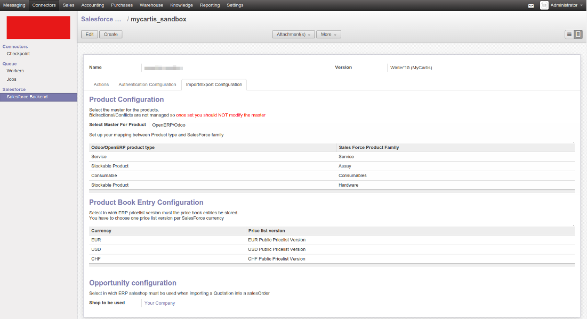

.. image:: https://img.shields.io/badge/licence-AGPL--3-blue.svg
   :target: https://www.gnu.org/licenses/agpl-3.0-standalone.html
   :alt: License: AGPL-3

====================
Salesforce Connector
====================

This module allows to import and export various models between
Odoo and Salesforce.

It provides the foundations to create or extend various synchronizations.

By default following synchronizations are supported out-of-the box:

 - Import of Account and contact into Odoo Partners. Salesforce is the master.
   Parent relation of Sales force account is not supported at this time.
 - Import or export of Product. ERP or Salesforce can be master. Bidirectional synchronization is not supported and a master must be set.
 - Import of Salesforce priceBook entries into Odoo pricelist version. Salesforce is the master.
 - Import of won opportunities into Odoo. Salesforce is the master.

Installation
============

To install this module, you need to:

 * install simplesalesforce

    `pip install simple-salesforce`

 * install requests

    `pip install requests`

Configuration
=============

Configure Connection With Salesforce
------------------------------------

There are 2 supported ways to access a Salesforce instance with the Salesforce connector

Oauth2 flow
***********

In Salesforce
#############

In order to use it you have to add a remote application in Salesforce administration
and enable Oauth2 login. The app should preferably be named `odoo_connector`

The created remote access app must have following parameters:

  Permitted Users --> All users may self-authorize
  Callback URL --> public_odoo_url/salesforce/oauth

Once done, you have to manage your app and ensure the
`Refresh token is valid until revoked` parameter is set
and configure the desired authorization of the app.

In Odoo
#######

Go to the menu `Connector -> Salesforce -> Salesforce backend` and create a new backend.
Go to the `Authentication` page of your backend and input the following parameters:

 - `Authentication Method`: Choose oauth2
 - `URL`: Input the URL of your Salesforce instance
 - `Connect on sandbox instance`: Check it if you are working on a sandox Salesforce instance
 - `OAuth2 Consumer Key`: Input the consumer key provided by Salesforce app
 - `OAuth2 secret`: Input the consumer secret provided by Salesforce app
 - `Public secure URL of Odoo (HTTPS)`: Input the callback URL you have specified in Salesforce
 - `OAuth2 client authorization code`: Input the authorization code provided by Salesforce app

Choose a default shop in `Import/Export Configuration` page and save your backend.

Then simply press the `Authorize Odoo in Salesforce` button and follow the instruction provided
in Salesforce. Once done, your application must be authorized in Salesforce and tokens
must be present in backend.

Security warning: Only the OAuth flow is production proof. Other Authentication methods are still exprimental!

User Authentication process
***************************

This flow allows a user to connect to api using SOAP access
in order to get a token. The first step is to pass the domain of your Salesforce instance
and an access token straight in Odoo backend.

You must have the full URL of your instance (e.g. https://na1.salesforce.com)

You need to select one of the two supported  means of authentication:

- Using username, password and security token
- Using IP filtering, username, password and organizationId

Security Warning: This approach is simpler but less secure than Oauth authentication process.

Configure Import Export with Salesforce
---------------------------------------

Once you backend is set up you can configure your synchronization flow in the
`Import/Export Configuration` page.

Products Synchronization
************************

The first step is to choose the direction of the product synchronization. Once
set, you should not change it anymore.

**  There is the possibility to do an initial import of the product and then change the direction **

Product Type Mapping
********************

Salesforce product type of Salesforce can not be imported and mapped in Odoo.
For this reason, you have to manually set the mapping in the `Product Configuration` section.
Simply select the Odoo type and link it with the corresponding Salesforce type.

Simply choose the Odoo type and input the corresponding name of the Salesforce type.

Price Book mapping
##################

Salesforce currencies can not be imported and mapped in Odoo.
You have to manually set the mapping under the `Product Book Entry Configuration` section.

Simply select an Odoo pricelist version with desired currency and link it with
a Currency ISO code available in Salesforce.

Once done, it should look like this:

Usage
=====

There are two ways to use the module: go to the backend and click on the Action
buttons available under the `Actions` page or activate one of the cron jobs,
depending on the desired synchronization in the
`Settings/technical/automation/scheduled` actions.

SF - Odoo: Synchronization summary
----------------------------------

+----------------------------------+-----------+--------------------------------+
| SalesForce                       | Direction | Odoo                           |
+==================================+===========+================================+
| Account                          |     →     | Partner                        |
|                                  |           | with the checkbox IsCompany    |
|                                  |           | checked                        |
+----------------------------------+-----------+--------------------------------+
| Contact                          |     →     | Partner                        |
|                                  |           | with the checkbox IsCompany    |
|                                  |           | unchecked linked to            |
|                                  |           | the parent partner             |
+----------------------------------+-----------+--------------------------------+
| State + Country + title          |     →     | State + Country + title        |
|                                  |           |                                |
+----------------------------------+-----------+--------------------------------+
| Product                          |   ← or →  | Product                        |
|                                  |           | Import of product was designed |
|                                  |           | for initial import and should  |
|                                  |           | not be used later even if it   |
|                                  |           | can work                       |
+----------------------------------+-----------+--------------------------------+
| Pricebook entry                  |     →     | Pricelist item                 |
|                                  |           |                                |
+----------------------------------+-----------+--------------------------------+
| Won Opportunity                  |     →     | Sale Order                     |
+----------------------------------+-----------+--------------------------------+

Test UseCase
------------

In Salesforce
*************

Creation of an Account
######################

 * Scroll down to see the section ‘Contact’ and click on ‘New contact’
   - create contact ‘Mrs Marie Durand’
   - create contact ‘Helmut’

Creation of an opportunity
##########################

 * Creation of the ‘opportunity A’
   - Scroll down to see the section ‘Quote’ and click on ‘New quote’

 * Creation of the Quote A1
   - with contact ‘Helmut’ (which does not belong to the Company A)
 * save

 * Scroll down to see the section ‘Quote Line items’ and click on ‘Add Line item’ in order to add products in the quote.
 * Tick the product and click on Select button

 * Change the price to 99, set the Qty = 5 and add a discount of 15%

 * Save

Set the Quote/Opportunity as Won
################################

 * Go back to the Quote, click on ‘Start Synch’ (and confirm)

 * Reopen the opportunity, click on Edit and change the stage to ‘Won’

 * Save

In Odoo
-------

Now the Opportunity can be synchronized with Odoo.

* Import won opportunity from Odoo. Importing Opportunity in Odoo will
  automatically trigger all other synchronizations. For instance, if you try to
  import an opportunity but the partner (= SF account) does not exist yet in
  Odoo, the connector will automatically launch a direct import of this
  specific account, without job creation. Same goes for the other missing items
  such as product, price, etc.

Known issues / Roadmap
======================

 - Cleanup and DRY refactoring for common code to be done
 - Extend the test coverage to product and corner cases
 - Improve SO onchange management
 - Fix simple Salesforce exception lookup on next release of library
 - Import Sales Quotation must copy, store and set as inactive the created address
 - Support the usecase of deactivating a deleted binding
 - Battle test authentication process and fix it

.. image:: https://odoo-community.org/website/image/ir.attachment/5784_f2813bd/datas
   :alt: Try me on Runbot
   :target: https://runbot.odoo-community.org/runbot/216/8.0

Credits
=======

Images
------

* Odoo Community Association: `Icon <https://github.com/OCA/maintainer-tools/blob/master/template/module/static/description/icon.svg>`_.

Contributors

* Nicolas Bessi
* Alexandre Fayolle <alexandre.fayolle@camptocamp.com>

Maintainer
----------

.. image:: https://odoo-community.org/logo.png
   :alt: Odoo Community Association
   :target: https://odoo-community.org

This module is maintained by the OCA.

OCA, or the Odoo Community Association, is a nonprofit organization whose
mission is to support the collaborative development of Odoo features and
promote its widespread use.

To contribute to this module, please visit https://odoo-community.org.
